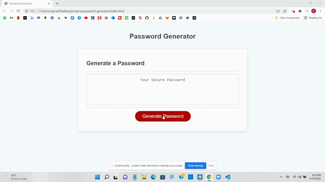

# Password Generator

### Created by Carolyn Hudson

---

## Description:
This application allows users to generate a random password between 8 and 128 characters that can consists of lowercase letters, uppercase letters, numbers, and special characters.

---

## Preview:
The following GIF demonstrates the web application's appearance and functionality:

---

## Links:

* GitHub [Repository](https://github.com/cghudson/password-generator)

* Deployed application [URL](https://cghudson.github.io/password-generator/) 